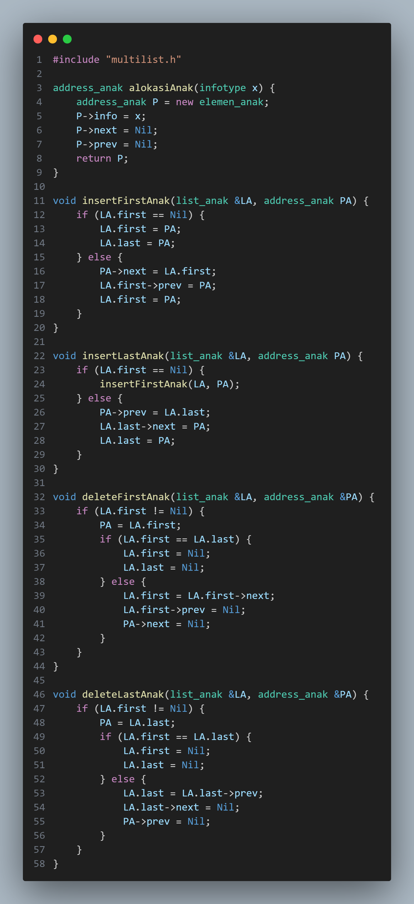
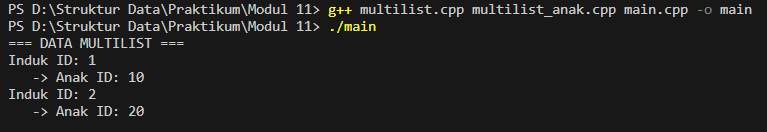
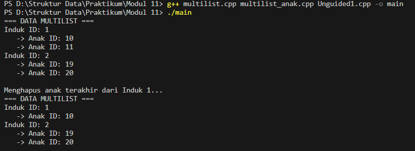
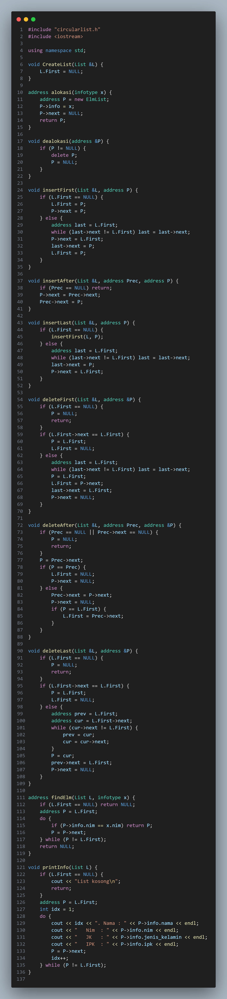
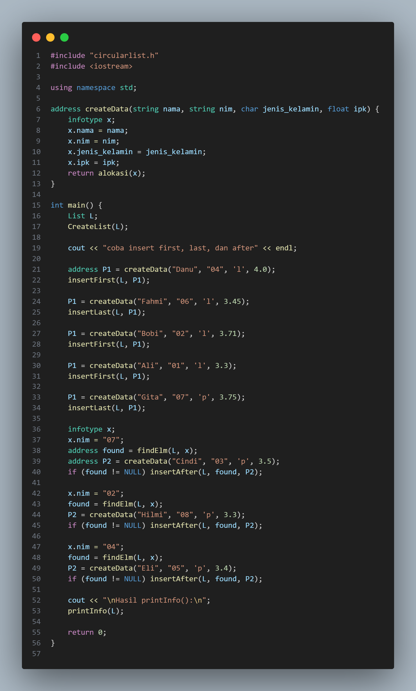

# Laporan Praktikum Struktur Data

## 1. Nama, NIM, Kelas
- **Nama**: Julian Saputra
- **NIM**: 103112400260
- **Kelas**: 12-IF-05

## 2. Motivasi Belajar Struktur Data
Saya sangat termotivasi memperlajari struktur data, kenapa saya belajat stuktur data karena saya sadar kalau struktur data itu pondasi yang sangat penting dalam pemrograman contohnya seperti kita akan membangun rumah yang membutuhkan pondasi. Lalu juga banyak aplikasi atau teknologi di dunia nyata contohnya kaya sistem pencarian, manajemen database, sampai ada juga kecerdasan buatan yang bekerja secara efisien dikarenakan menggunakan struktur data yang tepat dan baik. Jadi karena itu saya termotivasi belajar struktur data ini.

## 3. Dasar Teori
Struktur data adalah cara mengorganisir, menyimpan, dan mengelola data agar dapat diakses serta diproses dengan efisien. Pada praktikum ini digunakan dua jenis struktur data yang lebih kompleks, yaitu Multi Linked List (untuk hubungan Induk–Anak) dan Circular Linked List (untuk struktur melingkar tanpa ujung). Kedua struktur ini digunakan untuk menangani data hierarki dan data berulang yang membutuhkan efisiensi traversal.

### Berikut Dasar Teori nya :

1. Konsep Multi Linked List (Induk–Anak)

Multi Linked List adalah struktur data yang terdiri dari dua level linked list:
- List Induk -> berisi elemen-elemen induk
- List Anak -> setiap induk memiliki list anak sendiri

Pada tugas ini:
- Induk berisi ID induk
- Anak berisi ID anak yang terhubung ke induknya

Setiap induk memiliki:
- data (info)
- pointer ke anak pertama dan terakhir (doubly linked list)
- pointer ke induk berikutnya dan sebelumnya

Multi linked list membantu pemisahan data berdasarkan kategori, sehingga efisien untuk operasi pencarian dan pengelompokan.

2. Struktur Data Induk dan Anak

Pada program, terdapat dua struktur utama:

a. Struktur Induk

Berisi:
- info induk
- list anak (first & last)
- pointer next dan prev

b. Struktur Anak

Berisi:
- info anak
- pointer next dan prev (doubly linked list)

Struktur ganda ini memungkinkan data tersusun secara hierarki.

3. Konsep Insert pada Multi Linked List

a. Insert Last Induk

Menambah induk di bagian belakang list induk.

Langkah:
- Jika list kosong -> induk menjadi elemen pertama
- Jika tidak -> letakkan di posisi terakhir
- Perbarui pointer prev dan next

b. Insert Last Anak

Menambahkan anak pada induk tertentu.

Langkah:
- Temukan induk dengan findInduk()
- Tambahkan anak pada list anak induk
- Perbarui pointer prev dan next

Contoh struktur hasil:

Induk 1 -> Anak: 10, 11

Induk 2 -> Anak: 19, 20

4. Konsep Delete pada Multi Linked List

Tugas yang dikerjakan: menghapus anak terakhir dari induk tertentu.

Aturan:
- Jika list anak kosong -> tidak ada yang dihapus
- Jika satu elemen -> hapus dan set first=last=NULL
- Jika lebih dari satu -> pindahkan last ke last->prev

Contoh hasil setelah delete untuk Induk 1:

Sebelum: 10 -> 11

Sesudah: 10

5. Konsep Traversal Multi Linked List

Traversal dilakukan dua level:
- traversal induk
- pada setiap induk, traversal anak

Fungsi printInfo() dilakukan untuk menampilkan:

Induk ID: 1

    -> Anak ID: 10

    -> Anak ID: 11

Induk ID: 2

    -> Anak ID: 19

    -> Anak ID: 20
    
Traversal bersarang ini sangat penting untuk memvisualisasikan multilist.

6. Konsep Circular Linked List
Circular Linked List adalah bentuk linked list di mana:
- Node terakhir tidak menunjuk ke NULL
- Tetapi menunjuk kembali ke node pertama
Sehingga list bersifat melingkar.

Kelebihan Circular Linked List:
- Tidak ada akhir list -> traversal bisa berputar
- Efisien untuk struktur data yang membutuhkan “rotasi”
Cocok untuk:
- sistem giliran (round robin)
- antrian melingkar
- permainan kartu
- aplikasi navigasi siklus
Pada tugas ini circular linked list digunakan untuk menyimpan data siswa atau harga barang secara melingkar.

7. Konsep Modularisasi pada Program Queue
Untuk membuat program lebih rapi dan mudah dipahami, operasi queue seperti enqueue, dequeue, isEmpty, isFull, createQueue, dan printInfo dibuat dalam fungsi terpisah. Dengan cara ini, code menjadi lebih terstruktur, mudah diperbaiki, dan mengikuti prinsip abstraksi.

## 4. Guided
### 4.1 Guided 1

Penjelasan : Kode ini merupakan header untuk membuat ADT Queue menggunakan array. Queue dapat menampung maksimal 5 data bertipe int. Struktur Queue menyimpan array info, lalu head, tail, dan count untuk melacak posisi dan jumlah data. Fungsi createQueue digunakan untuk menginisialisasi queue, isEmptyQueue mengecek apakah queue kosong, dan isFullQueue mengecek apakah penuh. Fungsi enqueue menambahkan data ke belakang queue, dequeue mengambil data dari depan, dan printInfo menampilkan isi queue. Semua ini mengikuti prinsip FIFO (First In, First Out).

### 4.2 Guided 2

Penjelasan : Kode ini merupakan implementasi queue menggunakan circular array. createQueue mengatur queue agar mulai kosong. isEmpty mengecek apakah queue kosong, dan isFull mengecek apakah queue penuh. Fungsi enqueue menambah data di posisi tail, lalu memajukan tail secara melingkar dan menambah count. Fungsi dequeue mengambil data dari posisi head, memajukan head secara melingkar, serta mengurangi count. Jika penuh atau kosong, muncul pesan peringatan. Fungsi printInfo menampilkan isi queue dari head sebanyak jumlah elemen. Semua proses mengikuti aturan FIFO (First In, First Out).

### 4.3 Guided 3

Penjelasan : Kode main.cpp ini merupakan fungsi untuk menguji cara kerja ADT Queue yang telah dibuat. Program diawali dengan mencetak “Hello world!”, kemudian membuat sebuah objek Queue Q. Setelah itu, queue diinisialisasi dengan createQueue(Q) dan langsung ditampilkan isinya menggunakan printInfo(Q) yang pada awalnya tentu masih kosong. Selanjutnya, program menambahkan beberapa nilai ke dalam queue menggunakan enqueue, yaitu 5, 2, dan 7, di mana setiap penambahan selalu diikuti dengan printInfo untuk melihat perubahan isi queue. Setelah itu, program menghapus dua elemen dari depan queue menggunakan dequeue dan kembali menampilkan isi queue. Program kemudian menambahkan nilai baru, yaitu 4, dan menampilkannya lagi. Dua operasi dequeue terakhir mengeluarkan sisa elemen hingga queue kembali kosong. Secara keseluruhan, program ini memperlihatkan proses enqueue dan dequeue secara berurutan serta bagaimana kondisi queue berubah setelah setiap operasi, sesuai prinsip FIFO.

### 4.4 Guided 4

Penjelasan : Kode main.cpp ini merupakan fungsi untuk menguji cara kerja ADT Queue yang telah dibuat. Program diawali dengan mencetak “Hello world!”, kemudian membuat sebuah objek Queue Q. Setelah itu, queue diinisialisasi dengan createQueue(Q) dan langsung ditampilkan isinya menggunakan printInfo(Q) yang pada awalnya tentu masih kosong. Selanjutnya, program menambahkan beberapa nilai ke dalam queue menggunakan enqueue, yaitu 5, 2, dan 7, di mana setiap penambahan selalu diikuti dengan printInfo untuk melihat perubahan isi queue. Setelah itu, program menghapus dua elemen dari depan queue menggunakan dequeue dan kembali menampilkan isi queue. Program kemudian menambahkan nilai baru, yaitu 4, dan menampilkannya lagi. Dua operasi dequeue terakhir mengeluarkan sisa elemen hingga queue kembali kosong. Secara keseluruhan, program ini memperlihatkan proses enqueue dan dequeue secara berurutan serta bagaimana kondisi queue berubah setelah setiap operasi, sesuai prinsip FIFO.

Output : 

## 5. Unguided
### 5.1 Unguided 1

Penjelasan : Kode ini merupakan versi sederhana dari queue yang disimpan dalam array biasa, tanpa konsep “melingkar”. Saat queue dibuat lewat createQueue, nilai head dan tail diset ke -1, artinya masih benar-benar kosong. Fungsi isEmptyQueue mengecek apakah queue kosong dengan melihat apakah tail masih -1, sedangkan isFullQueue mengecek apakah posisi tail sudah mencapai batas array (MAX_QUEUE - 1).
Pada fungsi enqueue, kalau queue masih kosong, posisi head dipindah ke 0, lalu tail dinaikkan satu dan data disimpan. Kalau queue penuh, muncul pesan peringatan. Sedangkan pada dequeue, data paling depan diambil dari posisi head, lalu seluruh elemen di belakangnya digeser maju satu posisi supaya tetap rapi. Setelah itu tail diturunkan satu. Kalau setelah penghapusan ternyata queue kosong lagi, head dan tail dikembalikan ke -1. Terakhir, fungsi printInfo hanya menampilkan posisi head–tail dan isi queue saat ini.
Singkatnya, kode ini menunjukkan cara kerja queue yang mengikuti aturan FIFO, tapi dengan metode geser setiap kali ada elemen yang dikeluarkan.

Output : 

### 5.2 Unguided 2

#### Circular.h

Penjelasan : Kode ini merupakan implementasi queue sederhana yang memakai array biasa, tapi dengan cara kerja yang lebih praktis karena tidak perlu menggeser elemen saat dequeue. Saat queue dibuat lewat createQueue, nilai head dan tail diset ke -1 supaya jelas kalau antreannya masih kosong. Fungsi isEmptyQueue mengecek dua kondisi: apakah tail masih -1, atau apakah head sudah lewat tail—ini digunakan untuk mendeteksi kalau queue kosong setelah beberapa kali dequeue. Sementara itu, isFullQueue hanya mengecek apakah tail sudah mencapai batas array.
Pada fungsi enqueue, kalau queue penuh, muncul pesan antrean penuh. Kalau masih ada ruang, data baru dimasukkan ke posisi tail + 1. Kalau sebelumnya queue kosong, head otomatis di-set ke 0 lebih dulu. Untuk dequeue, data diambil dari posisi head, lalu head dinaikkan satu langkah. Kalau setelah dinaikkan ternyata head melewati tail, itu berarti queue sudah kosong lagi, jadi head dan tail dikembalikan ke -1. Terakhir, printInfo cuma menampilkan posisi head–tail dan isi queue dari head sampai tail.
Secara keseluruhan, kode ini menunjukkan queue dengan model FIFO, tapi lebih simpel karena tidak perlu menggeser elemen setiap kali menghapus data.

#### Circular.cpp

Penjelasan : Kode ini merupakan implementasi queue sederhana yang memakai array biasa, tapi dengan cara kerja yang lebih praktis karena tidak perlu menggeser elemen saat dequeue. Saat queue dibuat lewat createQueue, nilai head dan tail diset ke -1 supaya jelas kalau antreannya masih kosong. Fungsi isEmptyQueue mengecek dua kondisi: apakah tail masih -1, atau apakah head sudah lewat tail—ini digunakan untuk mendeteksi kalau queue kosong setelah beberapa kali dequeue. Sementara itu, isFullQueue hanya mengecek apakah tail sudah mencapai batas array.
Pada fungsi enqueue, kalau queue penuh, muncul pesan antrean penuh. Kalau masih ada ruang, data baru dimasukkan ke posisi tail + 1. Kalau sebelumnya queue kosong, head otomatis di-set ke 0 lebih dulu. Untuk dequeue, data diambil dari posisi head, lalu head dinaikkan satu langkah. Kalau setelah dinaikkan ternyata head melewati tail, itu berarti queue sudah kosong lagi, jadi head dan tail dikembalikan ke -1. Terakhir, printInfo cuma menampilkan posisi head–tail dan isi queue dari head sampai tail.
Secara keseluruhan, kode ini menunjukkan queue dengan model FIFO, tapi lebih simpel karena tidak perlu menggeser elemen setiap kali menghapus data.

#### Unguided2.cpp

Penjelasan : Kode ini merupakan implementasi queue sederhana yang memakai array biasa, tapi dengan cara kerja yang lebih praktis karena tidak perlu menggeser elemen saat dequeue. Saat queue dibuat lewat createQueue, nilai head dan tail diset ke -1 supaya jelas kalau antreannya masih kosong. Fungsi isEmptyQueue mengecek dua kondisi: apakah tail masih -1, atau apakah head sudah lewat tail—ini digunakan untuk mendeteksi kalau queue kosong setelah beberapa kali dequeue. Sementara itu, isFullQueue hanya mengecek apakah tail sudah mencapai batas array.
Pada fungsi enqueue, kalau queue penuh, muncul pesan antrean penuh. Kalau masih ada ruang, data baru dimasukkan ke posisi tail + 1. Kalau sebelumnya queue kosong, head otomatis di-set ke 0 lebih dulu. Untuk dequeue, data diambil dari posisi head, lalu head dinaikkan satu langkah. Kalau setelah dinaikkan ternyata head melewati tail, itu berarti queue sudah kosong lagi, jadi head dan tail dikembalikan ke -1. Terakhir, printInfo cuma menampilkan posisi head–tail dan isi queue dari head sampai tail.
Secara keseluruhan, kode ini menunjukkan queue dengan model FIFO, tapi lebih simpel karena tidak perlu menggeser elemen setiap kali menghapus data.

Output : 

## 6. Kesimpulan
Jadi berdasarkan hasil pengerjaan program di atas, dapat saya simpulkan bahwa tujuan pembelajaran mengenai penerapan struktur data Queue (Antrian) telah berhasil dicapai. Melalui implementasi berbagai operasi seperti enqueue, dequeue, isEmpty, isFull, serta printInfo, saya mampu memahami bagaimana data dapat disimpan dan dikelola menggunakan prinsip FIFO (First In, First Out). Struktur data Queue memungkinkan pengelolaan data secara berurutan, di mana elemen yang masuk lebih dulu akan menjadi yang pertama keluar.
Selain itu, penerapan konsep circular queue memberikan efisiensi yang lebih baik karena tidak memerlukan penggeseran elemen secara manual, sehingga operasi berjalan lebih optimal. Penggunaan fungsi-fungsi terpisah juga membuat program lebih rapi, mudah dipahami, dan sesuai dengan konsep modularisasi. Dengan demikian, praktikum ini memberikan pemahaman yang baik mengenai konsep dasar dan penerapan nyata dari struktur data Queue dalam bahasa C++.

## 7. Referensi
1. Programiz. “Queue Data Structure.” https://www.programiz.com/dsa/queue
2. GeeksforGeeks. “Queue Data Structure (Introduction and Implementation).” https://www.geeksforgeeks.org/queue-data-structure/
3. W3Schools. “C++ Arrays & Functions.” https://www.w3schools.com/cpp/cpp_arrays.asp