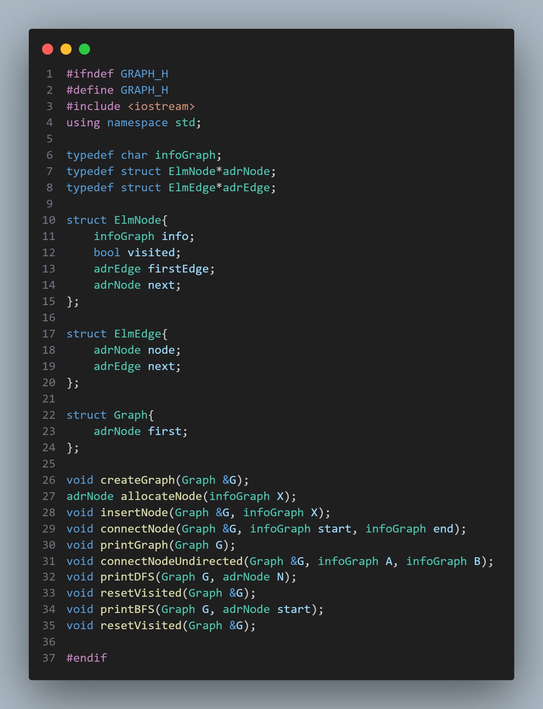
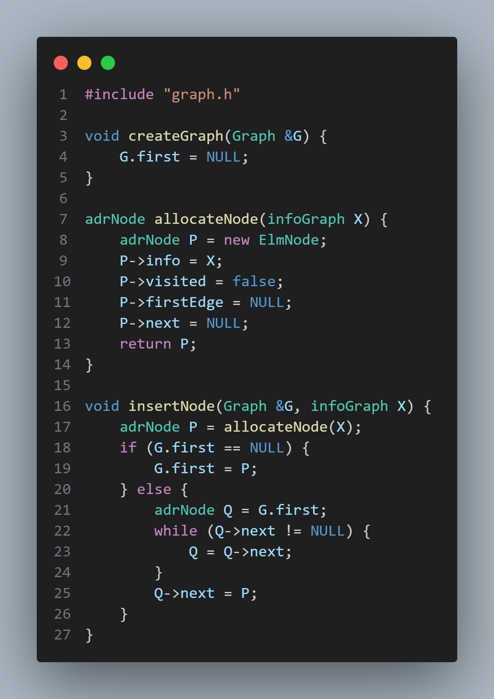
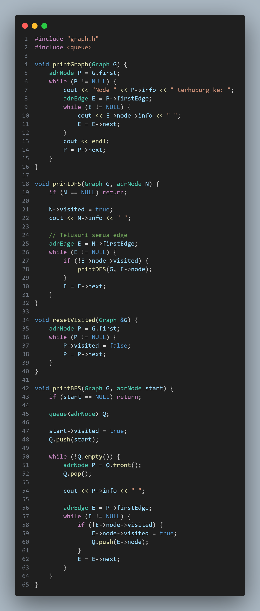
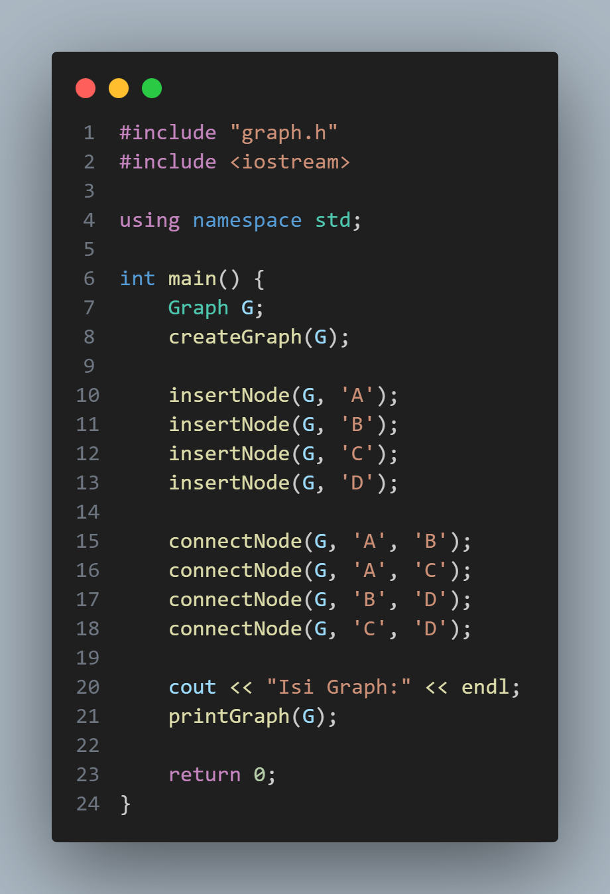
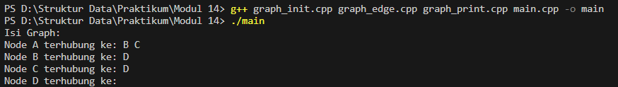
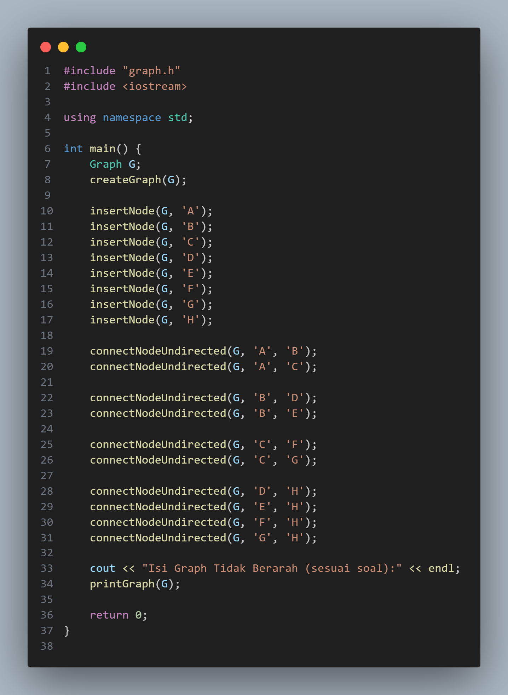
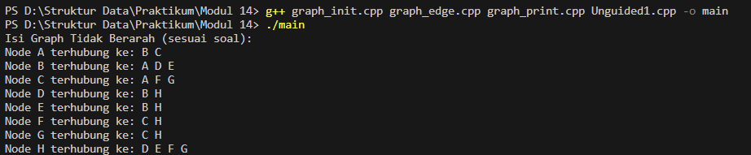
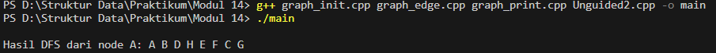
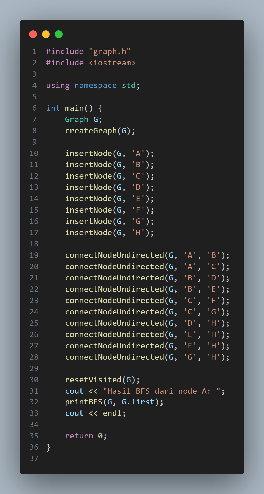
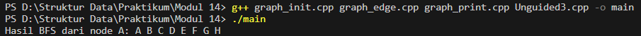

# Laporan Praktikum Struktur Data

## 1. Nama, NIM, Kelas
- **Nama**: Julian Saputra
- **NIM**: 103112400260
- **Kelas**: 12-IF-05

## 2. Motivasi Belajar Struktur Data
Saya sangat termotivasi memperlajari struktur data, kenapa saya belajat stuktur data karena saya sadar kalau struktur data itu pondasi yang sangat penting dalam pemrograman contohnya seperti kita akan membangun rumah yang membutuhkan pondasi. Lalu juga banyak aplikasi atau teknologi di dunia nyata contohnya kaya sistem pencarian, manajemen database, sampai ada juga kecerdasan buatan yang bekerja secara efisien dikarenakan menggunakan struktur data yang tepat dan baik. Jadi karena itu saya termotivasi belajar struktur data ini.

## 3. Dasar Teori
Struktur data adalah cara untuk menyimpan, mengatur, dan mengelola data agar dapat digunakan secara efisien. Pada praktikum ini digunakan struktur data Graph yang direpresentasikan menggunakan Adjacency List berbasis linked list. Graph sangat cocok untuk memodelkan hubungan antar data, seperti jaringan komputer, peta, dan struktur keterkaitan antar objek.

### Berikut Dasar Teori nya :

1. Konsep Graph

Graph merupakan struktur data yang terdiri dari kumpulan node (vertex) dan hubungan antar node yang disebut edge. Setiap node merepresentasikan sebuah objek, sedangkan edge menunjukkan keterhubungan antar objek tersebut. Graph umumnya dinotasikan sebagai G = (V, E), di mana V adalah himpunan node dan E adalah himpunan edge. Dalam praktikum ini, node dilambangkan dengan huruf seperti A, B, C, dan seterusnya.

2. Graph Tidak Berarah (Undirected Graph)

Graph tidak berarah adalah graph yang memiliki hubungan dua arah antar node. Jika sebuah node A terhubung ke node B, maka node B juga terhubung ke node A. Pada program, konsep ini diterapkan dengan menambahkan dua edge untuk setiap hubungan, yaitu dari A ke B dan dari B ke A. Hal ini diimplementasikan melalui fungsi connectNodeUndirected() agar keterhubungan antar node bersifat dua arah.

3. Representasi Graph dengan Adjacency List

Adjacency list adalah cara merepresentasikan graph dengan menyimpan setiap node beserta daftar node tetangganya. Setiap node memiliki pointer ke list edge yang berisi node-node yang terhubung dengannya. Representasi ini lebih efisien dalam penggunaan memori dibandingkan adjacency matrix, terutama jika jumlah edge tidak terlalu banyak. Selain itu, adjacency list memudahkan proses traversal seperti DFS dan BFS.

4. Struktur Node dan Edge

Dalam program, graph dibangun menggunakan dua struktur utama, yaitu node dan edge. Struktur node menyimpan informasi berupa data node, penanda kunjungan (visited), pointer ke edge pertama, dan pointer ke node berikutnya. Sementara itu, struktur edge menyimpan pointer ke node tujuan dan pointer ke edge berikutnya. Kombinasi kedua struktur ini membentuk graph berbasis linked list.

5. Konsep Traversal Graph

Traversal graph adalah proses mengunjungi seluruh node dalam graph dengan aturan tertentu. Traversal diperlukan untuk melihat struktur graph dan urutan keterhubungan antar node. Agar traversal tidak mengunjungi node yang sama berulang kali, digunakan atribut visited pada setiap node sebagai penanda apakah node tersebut sudah dikunjungi atau belum.

6. Depth First Search (DFS)

Depth First Search (DFS) adalah metode traversal graph yang menelusuri node secara mendalam. Traversal dimulai dari satu node, kemudian dilanjutkan ke salah satu node tetangganya hingga tidak ada node lain yang dapat dikunjungi, lalu kembali ke node sebelumnya. DFS biasanya diimplementasikan menggunakan rekursi. Pada program, DFS digunakan untuk menampilkan urutan kunjungan node berdasarkan penelusuran terdalam terlebih dahulu.

7. Breadth First Search (BFS)

Breadth First Search (BFS) adalah metode traversal graph yang menelusuri node secara melebar. Traversal dimulai dari node awal, kemudian mengunjungi semua node tetangganya terlebih dahulu sebelum berpindah ke level berikutnya. BFS menggunakan struktur data queue untuk menyimpan node yang akan dikunjungi. Metode ini cocok digunakan untuk pencarian berdasarkan level atau jarak terdekat.

8. Konsep Reset Visited

Sebelum melakukan traversal DFS atau BFS, seluruh node harus dikembalikan ke status belum dikunjungi. Hal ini dilakukan dengan mengatur nilai visited pada setiap node menjadi false. Fungsi resetVisited() digunakan agar traversal dapat dijalankan kembali dengan hasil yang benar tanpa terpengaruh oleh proses traversal sebelumnya.

9. Konsep Modularisasi Program

Program graph dibangun dengan konsep modularisasi, yaitu memisahkan kode ke dalam beberapa file sesuai fungsinya. File header digunakan untuk deklarasi struktur dan fungsi, sedangkan file implementasi berisi definisi fungsi-fungsi tersebut. Main program hanya berisi pemanggilan fungsi. Modularisasi membuat program lebih rapi, mudah dipahami, dan mudah dikembangkan.

10. Alur Program Secara Umum

Alur program dimulai dengan membuat graph kosong, kemudian menambahkan node ke dalam graph. Setelah itu, node-node dihubungkan menggunakan edge tidak berarah. Sebelum traversal dilakukan, status visited di-reset terlebih dahulu. Selanjutnya program melakukan traversal DFS atau BFS dari node awal dan menampilkan hasil penelusuran ke layar.

## 4. Guided
### 4.1 Guided 1

Penjelasan : Kode ini adalah header file ADT Graph yang menggunakan representasi adjacency list. Graph terdiri dari kumpulan node dan edge yang menunjukkan hubungan antar node. Setiap node disimpan dalam list utama dan memiliki list edge sendiri yang menunjuk ke node lain yang terhubung.
Struktur ElmNode menyimpan informasi node, penanda visited untuk keperluan DFS dan BFS, pointer ke edge pertama, serta pointer ke node berikutnya. Struktur ElmEdge digunakan untuk menyimpan hubungan antar node, sedangkan struktur Graph menyimpan pointer ke node pertama dalam graph.
Header ini menyediakan fungsi dasar seperti pembuatan graph, penambahan node, penghubungan node (berarah dan tidak berarah), serta fungsi untuk menampilkan isi graph. Selain itu, tersedia juga fungsi DFS dan BFS untuk menelusuri graph, serta fungsi resetVisited untuk mengatur ulang status kunjungan node. Dengan demikian, file ini menjadi dasar untuk membangun dan mengelola struktur data graph.

### 4.2 Guided 2

Penjelasan : Kode ini adalah implementasi operasi edge pada ADT Graph yang menggunakan representasi adjacency list. Graph disusun dari kumpulan node, di mana setiap node dapat terhubung dengan node lain melalui edge.
Fungsi findNode digunakan untuk mencari node tertentu di dalam graph berdasarkan nilai informasinya. Fungsi connectNode berfungsi untuk menghubungkan dua node secara berarah, yaitu dari node awal ke node tujuan dengan menambahkan edge ke dalam list edge milik node awal. Penambahan edge dilakukan di bagian akhir adjacency list agar urutan hubungan sesuai dengan urutan input.
Selain itu, fungsi connectNodeUndirected digunakan untuk membentuk graph tidak berarah, yaitu dengan menambahkan dua edge sekaligus sehingga kedua node saling terhubung. Dengan demikian, kode ini menyediakan mekanisme dasar untuk membangun hubungan antar node pada graph, baik berarah maupun tidak berarah.

### 4.3 Guided 3

Penjelasan : Kode ini adalah implementasi operasi dasar pada ADT Graph yang berkaitan dengan pembuatan dan pengelolaan node. Fungsi createGraph digunakan untuk menginisialisasi graph agar berada dalam kondisi kosong dengan mengatur pointer awal bernilai NULL. Fungsi allocateNode berfungsi untuk membuat node baru dengan mengisi data, mengatur status visited menjadi false, serta menginisialisasi pointer edge dan pointer ke node berikutnya.
Fungsi insertNode digunakan untuk menambahkan node baru ke dalam graph. Node disisipkan ke bagian akhir list node sehingga urutan node sesuai dengan urutan penambahan. Dengan demikian, kode ini menyediakan fungsi dasar untuk membangun struktur graph sebelum node-node tersebut dihubungkan dengan edge.

### 4.4 Guided 4

Penjelasan : Kode ini adalah fungsi-fungsi untuk menampilkan dan menelusuri ADT Graph menggunakan representasi adjacency list. Fungsi printGraph digunakan untuk menampilkan seluruh node beserta hubungan edge yang dimilikinya. Setiap node ditampilkan bersama daftar node lain yang terhubung dengannya.
Fungsi printDFS digunakan untuk melakukan penelusuran graph dengan metode Depth First Search (DFS), yaitu menelusuri node secara mendalam dari satu node ke node lain yang belum dikunjungi. Fungsi printBFS digunakan untuk melakukan penelusuran graph dengan metode Breadth First Search (BFS) menggunakan struktur data queue, sehingga penelusuran dilakukan secara melebar per level.
Selain itu, fungsi resetVisited digunakan untuk mengatur ulang status kunjungan (visited) pada seluruh node agar proses DFS atau BFS dapat dijalankan kembali. Dengan demikian, kode ini menyediakan operasi penelusuran dan penampilan graph secara lengkap dan terstruktur.

### 4.5 Guided 5

Penjelasan : Kode ini adalah program utama (main) yang digunakan untuk menguji implementasi ADT Graph. Pada awal program, graph dibuat dan diinisialisasi agar dalam keadaan kosong. Selanjutnya, beberapa node dimasukkan ke dalam graph, yaitu node A, B, C, dan D.
Setelah node berhasil ditambahkan, program menghubungkan node-node tersebut menggunakan fungsi connectNode sehingga terbentuk hubungan antar node sesuai dengan struktur graph berarah. Terakhir, fungsi printGraph digunakan untuk menampilkan isi graph beserta hubungan antar node ke layar. Dengan demikian, program ini berfungsi sebagai contoh penggunaan ADT Graph untuk membangun dan menampilkan struktur graph sederhana.

Output : 

## 5. Unguided
### 5.1 Unguided 1

Penjelasan : Kode ini adalah program utama yang digunakan untuk membangun dan menampilkan graph tidak berarah menggunakan ADT Graph. Program diawali dengan pembuatan graph kosong, kemudian menambahkan node A sampai H ke dalam graph.
Setelah itu, setiap node dihubungkan menggunakan fungsi connectNodeUndirected, sehingga hubungan antar node bersifat dua arah. Hubungan tersebut disusun sesuai dengan soal, di mana node A terhubung ke B dan C, node B dan C memiliki cabang masing-masing, dan semua jalur akhirnya terhubung ke node H.
Terakhir, fungsi printGraph digunakan untuk menampilkan seluruh isi graph beserta hubungan antar node ke layar. Dengan demikian, program ini berfungsi untuk menguji dan memperlihatkan struktur graph tidak berarah yang telah dibangun.

Output : 

### 5.2 Unguided 2

Penjelasan : Kode ini adalah program utama yang digunakan untuk membangun graph tidak berarah dan melakukan penelusuran Depth First Search (DFS). Program dimulai dengan membuat graph kosong, lalu menambahkan node A sampai H ke dalam graph.
Setelah semua node dibuat, hubungan antar node dibentuk menggunakan fungsi connectNodeUndirected sehingga setiap sisi berlaku dua arah sesuai dengan struktur graph pada soal. Sebelum melakukan DFS, fungsi resetVisited dipanggil untuk memastikan seluruh node berada dalam kondisi belum dikunjungi.
Proses DFS dimulai dari node A dengan memanggil fungsi printDFS, yang akan menelusuri graph secara mendalam dari satu cabang ke cabang lainnya dan menampilkan urutan kunjungan node ke layar. Dengan demikian, program ini berfungsi untuk membangun graph dan menampilkan hasil penelusuran DFS dari node awal.

Output : 

### 5.3 Unguided 3

Penjelasan : Kode ini adalah program utama yang digunakan untuk membangun graph tidak berarah dan melakukan penelusuran Breadth First Search (BFS). Program diawali dengan membuat graph kosong, kemudian menambahkan node A sampai H ke dalam graph.
Selanjutnya, hubungan antar node dibentuk menggunakan fungsi connectNodeUndirected sehingga setiap sisi bersifat dua arah sesuai dengan struktur graph pada soal. Setelah graph terbentuk, fungsi resetVisited dipanggil untuk mengatur ulang status kunjungan semua node agar BFS dapat berjalan dengan benar.
Proses BFS dimulai dari node A dengan memanggil fungsi printBFS. Penelusuran dilakukan secara melebar, yaitu mengunjungi semua node yang bertetangga terlebih dahulu sebelum berpindah ke level berikutnya, lalu hasil urutan kunjungan node ditampilkan ke layar. Dengan demikian, program ini berfungsi untuk menampilkan hasil penelusuran BFS pada graph yang telah dibuat.

Output : 

## 6. Kesimpulan
Jadi berdasarkan pemahaman dan implementasi struktur data pada program di atas, dapat disimpulkan bahwa tujuan pembelajaran mengenai penerapan struktur data Graph telah berhasil dicapai. Melalui pembuatan node, penghubungan antar node menggunakan edge tidak berarah, serta penerapan traversal DFS dan BFS, mahasiswa dapat memahami cara merepresentasikan dan mengelola hubungan antar data secara sistematis.

Graph yang direpresentasikan menggunakan adjacency list berbasis linked list terbukti efisien dalam menyimpan hubungan antar node dan memudahkan proses traversal. Penggunaan atribut visited sangat penting untuk mencegah node dikunjungi lebih dari satu kali, sehingga proses DFS dan BFS dapat berjalan dengan benar dan terkontrol.

Metode Depth First Search (DFS) memungkinkan penelusuran graph secara mendalam hingga ke node terdalam sebelum kembali, sedangkan Breadth First Search (BFS) menelusuri graph secara melebar berdasarkan level dengan bantuan struktur data queue. Kedua metode ini memberikan pemahaman yang berbeda mengenai pola penelusuran graph dan kegunaannya dalam berbagai kasus.

Selain itu, penerapan modularisasi program dengan pemisahan file header, file implementasi, dan file main membuat program lebih terstruktur, mudah dibaca, dan mudah dikembangkan. Dengan demikian, praktikum ini memberikan pemahaman yang baik mengenai konsep dasar graph, teknik traversal, serta penerapannya dalam bahasa pemrograman C++.

## 7. Referensi
1. Programiz. “Graph Data Structure.” (https://www.programiz.com/dsa/graph)
2. Programiz. “Depth First Search (DFS) Algorithm.” (https://www.programiz.com/dsa/depth-first-search)
3. Programiz. “Breadth First Search (BFS) Algorithm.” (https://www.programiz.com/dsa/breadth-first-search)
4. GeeksforGeeks. “Graph Data Structure and Algorithms.” (https://www.geeksforgeeks.org/graph-data-structure-and-algorithms/)
5. W3Schools. “C++ Pointers.” (https://www.w3schools.com/cpp/cpp_pointers.asp)