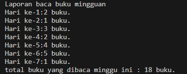
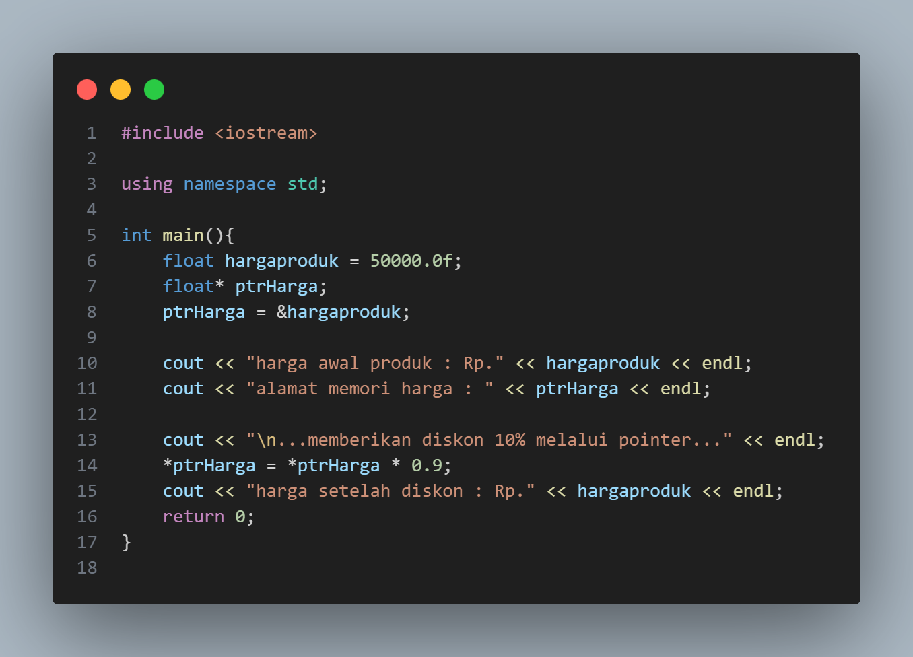
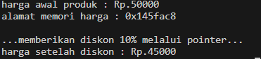
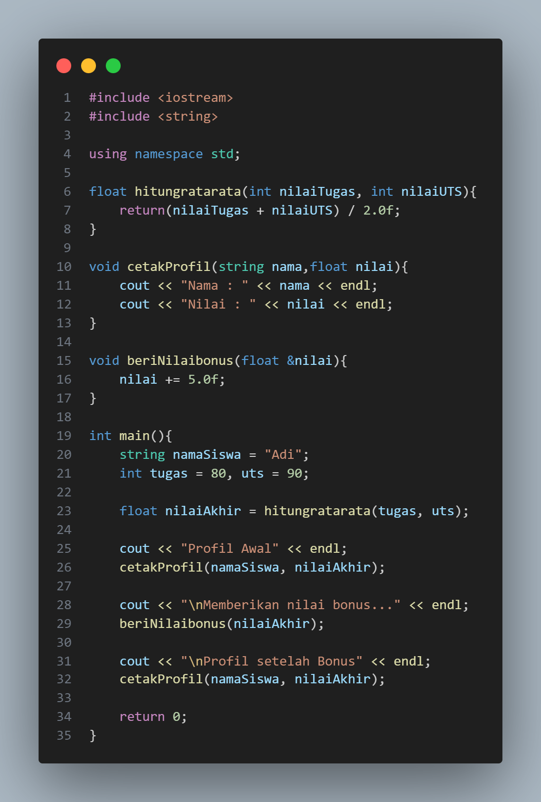
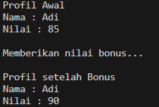

# Laporan Praktikum Struktur Data

## 1. Nama, NIM, Kelas
- **Nama**: Julian Saputra
- **NIM**: 103112400260
- **Kelas**: 12-IF-05

## 2. Motivasi Belajar Struktur Data
Saya sangat termotivasi memperlajari struktur data, kenapa saya belajat stuktur data karena saya sadar kalau struktur data itu pondasi yang sangat penting dalam pemrograman contohnya seperti kita akan membangun rumah yang membutuhkan pondasi. Lalu juga banyak aplikasi atau teknologi di dunia nyata contohnya kaya sistem pencarian, manajemen database, sampai ada juga kecerdasan buatan yang bekerja secara efisien dikarenakan menggunakan struktur data yang tepat dan baik. Jadi karena itu saya termotivasi belajar struktur data ini.

## 3. Dasar Teori
Struktur data adalah cara untuk menyimpan dan mengorganisir data dalam komputer agar dapat digunakan secara efisien. Jadi dalam konteks mata kuliah struktur data itu ada beberapa struktur yang sering kita gunakan yaitu adalah Graf dan Pohon. Berikut adalah teori dasar mengenai **Graf** dan **Pohon**:

- **Graf**: Merupakan struktur data yang digunakan sebagai mempresentasikan hubungan antar suatu objek. Graf juga terdiri dari 2 kumpulan yaitu simpul (vertex) dan busur (edge) yang menghubungkan antar simpul. Graf juga banyak digunakan berbagai aplikasi yaitu contohnya jaringan komputer, peta rute perjalanan (maps) dan media sosial.
- **Pohon**: merupakan bentuk khusus dari graf yang dia itu bersifat hierarkis dan tidak memiliki siklus. Pohon ini memiliki satu simpul utama yang kita sebut akar (root), lalu bercabang ke simpul yang lainnya. Struktur pohon seringkali digunakan dalam sistem file komputer, struktur organisasi, hingga pada algoritma pencarian seperti Binary Search Tree (BST).

## 4. Guided
### 4.1 Guided 1

Penjelasan :
Program ini digunakan untuk mencatat jumlah buku yang dibaca setiap hari selama satu minggu dan menghitung totalnya. Data jumlah buku disimpan dalam array, kemudian ditampilkan satu per satu menggunakan perulangan for. Setiap nilai juga dijumlahkan ke dalam variabel TotalBuku. Setelah selesai, program menampilkan total buku yang berhasil dibaca dalam seminggu. Program ini sederhana namun efektif untuk membuat laporan baca buku mingguan secara otomatis.

Output :

### 4.2 Guided 2

Penjelasan : Program ini digunakan untuk mengubah suhu dari satuan Celcius ke Fahrenheit, lalu memberikan komentar lucu berdasarkan hasilnya.

Output : 

### 4.3 Guided 3

Penjelasan : Program ini digunakan untuk mendemonstrasikan penggunaan operator tanda plus (+) pada ekspresi aritmatika. Pada program tersebut, variabel r diberi nilai awal 20, kemudian nilai variabel s dihitung menggunakan ekspresi 20 + + + r. Ekspresi tersebut sebenarnya dibaca sebagai 20 + (+(+r)), sehingga nilai r tetap 20. Hasil dari penjumlahan 20 dengan 20 disimpan ke dalam variabel s, yaitu 40. Setelah itu, program menampilkan nilai aktual dari variabel r dan s ke layar untuk menunjukkan bahwa variabel r tidak berubah, sedangkan s berisi hasil perhitungan.

Output : 

## 5. Unguided
### 5.1 Unguided 1

Penjelasan : Program ini dirancang untuk melakukan operasi aritmatika dasar antara dua bilangan pecahan (float). Pengguna diminta memasukkan dua input, yaitu bilangan pertama dan bilangan kedua. Setelah menerima input, program menampilkan hasil penjumlahan, pengurangan, dan perkalian dari kedua bilangan tersebut. Untuk operasi pembagian, program terlebih dahulu melakukan pengecekan menggunakan struktur kontrol if. Jika bilangan kedua tidak sama dengan nol, maka hasil pembagian ditampilkan. Namun jika bilangan kedua bernilai nol, program menampilkan pesan kesalahan (“pembagian error”) untuk mencegah terjadinya pembagian dengan nol yang tidak valid secara matematis. Dengan demikian, program ini tidak hanya melakukan perhitungan, tetapi juga memiliki penanganan kondisi khusus untuk menjaga keakuratan hasil.

Output : 

## 6. Kesimpulan
Jadi berdasarkan seluruh rangkaian praktikum yang telah dilakukan, dapat saya simpulkan bahwa tujuan dari praktikum ini yaitu tercapai, yaitu memahami konsep dasar pemrograman yang berkaitan dengan struktur data sederhana, percabangan, operasi aritmatika, konversi data, hingga penggunaan perulangan bersarang (nested loop). Melalui latihan Guided, saya dapat memahami bagaimana penggunaan kondisi (if-else) dan operator dalam menyelesaikan permasalahan sehari-hari, seperti menghitung diskon belanja atau mengonversi suhu. Sedangkan pada latihan Unguided, saya semakin terlatih dalam mengembangkan logika sendiri untuk menyelesaikan masalah, seperti melakukan operasi aritmatika dengan validasi pembagian, mengubah angka menjadi teks dalam bahasa Indonesia, serta membuat pola angka yang terstruktur.

Implementasi teori struktur data pada praktikum ini terlihat dari bagaimana data diolah, disimpan, dan ditampilkan kembali secara efisien. Saya juga dapat memahami bahwa struktur data dan logika pemrograman adalah pondasi penting untuk memecahkan berbagai permasalahan komputasi. Dengan menguasai dasar ini, saya bisa lebih siap mempelajari konsep yang lebih kompleks seperti graf, pohon, maupun algoritma pencarian dan pengurutan. Secara keseluruhan, praktikum ini meningkatkan pemahaman saya mengenai keterkaitan antara teori dan praktik, serta bagaimana konsep dasar dapat diterapkan dalam pembuatan program sederhana yang bermanfaat.

## 7. Referensi
1. GeeksforGeeks. “C++ Programming Language.” https://www.geeksforgeeks.org/c-plus-plus/
2. Tutorialspoint. “C++ Programming Language.” https://www.tutorialspoint.com/cplusplus/
3. W3Schools. “C++ Tutorial.” https://www.w3schools.com/cpp/