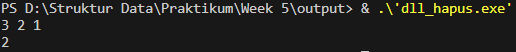
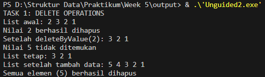
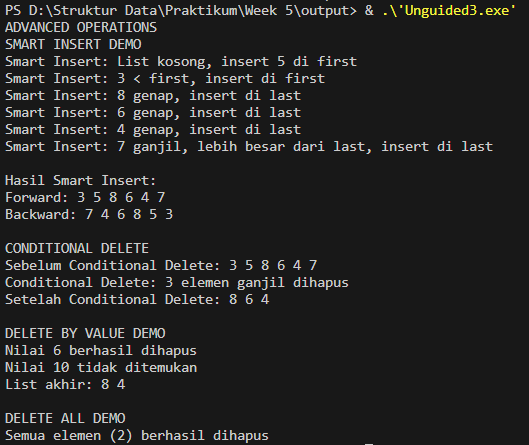

# Laporan Praktikum Struktur Data

## 1. Nama, NIM, Kelas
- **Nama**: Julian Saputra
- **NIM**: 103112400260
- **Kelas**: 12-IF-05

## 2. Motivasi Belajar Struktur Data
Saya sangat termotivasi memperlajari struktur data, kenapa saya belajat stuktur data karena saya sadar kalau struktur data itu pondasi yang sangat penting dalam pemrograman contohnya seperti kita akan membangun rumah yang membutuhkan pondasi. Lalu juga banyak aplikasi atau teknologi di dunia nyata contohnya kaya sistem pencarian, manajemen database, sampai ada juga kecerdasan buatan yang bekerja secara efisien dikarenakan menggunakan struktur data yang tepat dan baik. Jadi karena itu saya termotivasi belajar struktur data ini.

## 3. Dasar Teori
Struktur data adalah cara untuk menyimpan dan mengorganisir data dalam komputer agar dapat digunakan secara efisien. Dalam konteks mata kuliah Struktur Data, salah satu struktur yang penting dan sering digunakan adalah Linked List, khususnya Double Linked List (DLL). Struktur ini digunakan ketika diperlukan penyimpanan data yang dinamis, fleksibel, dan mudah dimodifikasi (seperti penambahan atau penghapusan elemen di tengah daftar).

### Berikut Dasar Teori nya :

1. Konsep Double Linked List (DLL):
Double Linked List merupakan bentuk lanjutan dari Single Linked List, di mana setiap elemen (node) memiliki dua pointer: satu menunjuk ke elemen sebelumnya (prev) dan satu menunjuk ke elemen berikutnya (next). Dengan dua arah ini, proses penelusuran dapat dilakukan maju (forward) maupun mundur (backward). DLL memudahkan operasi seperti penyisipan dan penghapusan elemen di berbagai posisi (awal, tengah, atau akhir) tanpa perlu menggeser elemen lain seperti pada array.

2. Konsep Pointer dalam Linked List:
Pointer adalah variabel khusus yang menyimpan alamat memori dari variabel lain. Dalam DLL, pointer digunakan untuk menghubungkan antar-node. Contohnya, P->next menunjuk ke node berikutnya, sedangkan P->prev menunjuk ke node sebelumnya. Pemahaman pointer sangat penting karena kesalahan dalam pengaturan next atau prev dapat menyebabkan kehilangan data (memory leak) atau crash program.

3. Konsep Fungsi smartInsert:
Fungsi ini merupakan bentuk insertion dengan logika kondisional yang kompleks, di mana data baru tidak hanya ditambahkan di awal atau akhir, tetapi juga disisipkan berdasarkan aturan tertentu (misalnya ganjil/genap, nilai lebih besar/kecil, atau posisi tertentu di antara dua nilai). Fungsi ini menggunakan if–else bertingkat untuk menangani berbagai kondisi, termasuk ketika list kosong atau saat elemen baru harus berada di antara dua node tertentu. Konsep ini menunjukkan penerapan logika pemrograman dan kontrol alur (flow control) pada struktur data dinamis.

4. Konsep Fungsi conditionalDelete:
Fungsi ini digunakan untuk menghapus elemen dalam list berdasarkan kondisi tertentu (misalnya, menghapus semua angka ganjil, semua angka genap, atau elemen yang memenuhi kriteria khusus). Prosesnya melibatkan penelusuran seluruh node dan pemeriksaan kondisi setiap elemen dengan if–else. Jika elemen memenuhi syarat, maka node tersebut dihapus dan pointer diatur ulang agar hubungan antar-node tetap konsisten. Fungsi ini juga menunjukkan penerapan algoritma traversing dan manajemen memori dinamis.

5. Konsep Traversal (Penelusuran Data):
Traversal adalah proses mengunjungi setiap node dalam linked list untuk menampilkan, mencari, atau memodifikasi data. Dalam DLL, traversal dapat dilakukan dari depan ke belakang (forward) maupun dari belakang ke depan (backward), berkat adanya dua pointer (next dan prev). Proses ini sering digunakan dalam menampilkan hasil seperti "Forward: 3 5 7 8 6 4" dan "Backward: 4 6 8 7 5 3".

6. Konsep Fungsi dan Modularisasi Program:
Fungsi seperti insertFirst, insertLast, smartInsert, dan conditionalDelete dibuat agar program lebih modular dan mudah dipahami. Dengan memisahkan setiap operasi ke dalam fungsi tersendiri, kode menjadi lebih rapi, mudah diuji, serta bisa digunakan kembali (reusable). Pendekatan modular ini juga mendukung prinsip abstraksi, di mana setiap fungsi memiliki tanggung jawab yang jelas.

## 4. Guided
### 4.1 Guided 1

Penjelasan : Program ini membuat struktur elmlist yang berisi data (info), pointer ke elemen berikutnya (next), dan pointer ke elemen sebelumnya (prev). Lalu ada List yang menyimpan elemen pertama (first) dan terakhir (last). Fungsi insertFirst menambah data di depan list, insertLast menambah data di akhir, dan insertAfter menambah data setelah elemen tertentu. Fungsi alokasi membuat node baru, dan printInfo menampilkan isi list.

Output :

### 4.2 Guided 2

Penjelasan : Program ini membuat dan mengelola Double Linked List (DLL), yaitu struktur data yang tiap elemennya terhubung dua arah. Pertama, program membuat tiga data (1, 2, dan 3) dan menambahkannya ke list di bagian depan, sehingga urutannya menjadi 3 2 1. Setelah itu, elemen pertama (3) dihapus menggunakan deleteFirst, lalu elemen setelah elemen pertama (yaitu 1) dihapus menggunakan deleteAfter. Hasil akhirnya, list hanya menyisakan satu data yaitu 2. Program ini menunjukkan cara menambah dan menghapus elemen dalam Double Linked List dengan benar.

Output : 

## 5. Unguided
### 5.1 Unguided 1

Penjelasan : Program ini implementasi Double Linked List (DLL) yang dapat menambah elemen di awal, akhir, setelah, dan sebelum elemen tertentu. Program ini menggunakan dua struktur utama, yaitu elmlist sebagai node yang menyimpan data serta pointer ke elemen berikut dan sebelumnya, dan List yang menyimpan pointer ke elemen pertama (first) dan terakhir (last). Fungsi alokasi digunakan untuk membuat node baru, sedangkan fungsi insertFirst, insertLast, dan insertAfter digunakan untuk menambah elemen di depan, di belakang, dan setelah elemen tertentu. Fungsi insertBefore digunakan untuk menambah elemen sebelum data yang dicari, dan jika data tersebut tidak ditemukan maka program akan menampilkan pesan kesalahan. Pada fungsi main, list awalnya kosong kemudian ditambahkan data 1 di awal, 2 di akhir, dan 3 setelah 1, sehingga terbentuk urutan 1 3 2. Selanjutnya, angka 4 disisipkan sebelum 2 dan angka 5 disisipkan sebelum 1, menghasilkan urutan akhir 5 1 3 4 2. Program kemudian menampilkan isi list secara maju (forward) dan mundur (backward) untuk menunjukkan bahwa setiap node saling terhubung dua arah dengan benar.

Output : 

### 5.2 Unguided 2

Penjelasan : Program ini merupakan implementasi Double Linked List (DLL) yang memiliki berbagai operasi untuk menghapus data, baik berdasarkan posisi maupun nilai tertentu. Program ini menggunakan dua struktur utama, yaitu elmlist sebagai node yang menyimpan data (info) serta penunjuk ke elemen berikut (next) dan sebelumnya (prev), dan List yang menyimpan alamat elemen pertama (first) dan terakhir (last). Fungsi alokasi digunakan untuk membuat node baru, sedangkan dealokasi berfungsi menghapus node dari memori agar tidak terjadi kebocoran memori. Program juga memiliki beberapa operasi penting seperti insertFirst dan insertLast untuk menambah elemen di awal atau akhir list, serta printInfo untuk menampilkan isi list. Operasi penghapusan mencakup deleteFirst untuk menghapus elemen pertama, deleteLast untuk menghapus elemen terakhir, deleteAfter untuk menghapus elemen setelah elemen tertentu, deleteByValue untuk mencari dan menghapus elemen berdasarkan nilai tertentu, serta deleteAll untuk menghapus seluruh elemen dalam list. Pada fungsi main, list awalnya diisi dengan data 2, 3, 2, 1, lalu dilakukan penghapusan nilai 2 menggunakan deleteByValue(2) sehingga hanya satu data 2 yang dihapus. Jika nilai yang ingin dihapus tidak ada (seperti deleteByValue(5)), program akan menampilkan pesan bahwa nilai tersebut tidak ditemukan. Setelah itu, data 4 dan 5 ditambahkan kembali ke dalam list, kemudian seluruh elemen dihapus menggunakan deleteAll. Secara keseluruhan, program ini memperlihatkan bagaimana cara menambah, mencari, dan menghapus elemen pada Double Linked List dengan tetap menjaga hubungan dua arah antar node agar struktur list tetap konsisten.

Output : 

### 5.3 Unguided 3

Penjelasan : Program ini merupakan implementasi Double Linked List (DLL) dengan berbagai operasi lanjutan seperti smart insert, conditional delete, delete by value, dan delete all. Program ini menggunakan dua struktur utama, yaitu elmlist sebagai node yang menyimpan data serta penunjuk ke elemen berikut (next) dan sebelumnya (prev), dan List yang menyimpan alamat elemen pertama (first) dan terakhir (last). Fungsi alokasi digunakan untuk membuat node baru, sedangkan dealokasi berfungsi untuk menghapus node dari memori agar tidak terjadi kebocoran memori. Pada bagian smartInsert, data dimasukkan dengan aturan tertentu: jika list kosong maka data ditambahkan di awal, jika lebih kecil dari elemen pertama maka ditempatkan di depan, jika data genap maka dimasukkan di akhir, dan jika data ganjil lebih besar dari elemen terakhir juga ditempatkan di akhir. Selain itu, jika ditemukan elemen bernilai 5 dan 7 yang berurutan, data baru akan disisipkan di antara keduanya. Fungsi conditionalDelete digunakan untuk menghapus semua elemen dengan nilai ganjil dan menghitung jumlah elemen yang dihapus, sedangkan deleteByValue berfungsi untuk menghapus elemen tertentu berdasarkan nilainya, dan deleteAll menghapus seluruh isi list hingga kosong. Pada fungsi main, dilakukan berbagai operasi seperti penambahan data dengan smart insert, penghapusan elemen ganjil dengan conditional delete, penghapusan nilai tertentu dengan delete by value, serta pengosongan seluruh list dengan delete all. Secara keseluruhan, program ini menunjukkan cara mengelola data secara dinamis dalam struktur Double Linked List dengan mempertahankan hubungan dua arah antar node secara efisien.

Output : 

## 6. Kesimpulan
Jadi berdasarkan hasil pengerjaan diatas dapat disimpulkan bahwa tujuan pembelajaran terkait penerapan struktur data Double Linked List (DLL) telah berhasil dicapai. Melalui implementasi berbagai operasi seperti insert, delete, smart insert, conditional delete, delete by value, dan delete all, saya memahami bagaimana cara mengelola data secara dinamis dalam memori menggunakan pointer. Double Linked List memungkinkan pergerakan data dua arah (maju dan mundur), sehingga proses penambahan dan penghapusan data menjadi lebih fleksibel dan efisien dibandingkan struktur data linear biasa. Selain itu, penerapan fungsi-fungsi terpisah membantu menyusun program dengan lebih sistematis dan mudah dipahami. Dengan demikian, praktikum ini memberikan pemahaman yang kuat mengenai konsep dasar dan penerapan nyata dari struktur data Double Linked List dalam bahasa C++.

## 7. Referensi
1. Programiz. “Doubly Linked List in C++.” https://www.programiz.com/dsa/doubly-linked-list
2. GeeksforGeeks. “Doubly Linked List | Set 1 (Introduction and Insertion).” https://www.geeksforgeeks.org/doubly-linked-list/
3. TutorialsTeacher. “C++ Pointers.” https://www.tutorialsteacher.com/cpp/cpp-pointers