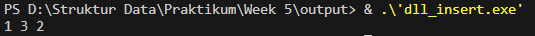

# Laporan Praktikum Struktur Data

## 1. Nama, NIM, Kelas
- **Nama**: Julian Saputra
- **NIM**: 103112400260
- **Kelas**: 12-IF-05

## 2. Motivasi Belajar Struktur Data
Saya sangat termotivasi memperlajari struktur data, kenapa saya belajat stuktur data karena saya sadar kalau struktur data itu pondasi yang sangat penting dalam pemrograman contohnya seperti kita akan membangun rumah yang membutuhkan pondasi. Lalu juga banyak aplikasi atau teknologi di dunia nyata contohnya kaya sistem pencarian, manajemen database, sampai ada juga kecerdasan buatan yang bekerja secara efisien dikarenakan menggunakan struktur data yang tepat dan baik. Jadi karena itu saya termotivasi belajar struktur data ini.

## 3. Dasar Teori
Struktur data adalah cara untuk menyimpan dan mengorganisir data dalam komputer agar dapat digunakan secara efisien. Jadi dalam konteks mata kuliah struktur data itu ada beberapa struktur yang sering kita gunakan yaitu adalah Graf dan Pohon. Berikut adalah teori dasar mengenai **Graf** dan **Pohon**:

- **Konsep Array**: merupakan struktur data yang digunakan untuk menyimpan beberapa nilai sekaligus dalam satu variabel dengan tipe data yang sama. Jika biasanya kita menyimpan satu nilai dalam satu variabel, seperti int a = 10;, maka dengan array kita bisa menyimpan banyak nilai seperti int a[5] = {10, 20, 30, 40, 50};. Setiap nilai array disimpan dalam indeks tertentu yang dimulai dari 0, sehingga memudahkan akses dan pengelolaan data dalam jumlah banyak. Array sering digunakan dalam berbagai kasus seperti daftar nilai siswa, stok barang, atau data sensor.
- **Konsep Pointer**: merupakan variabel khusus yang menyimpan alamat memori dari variabel lain. Jika variabel biasa menyimpan nilai, pointer justru menyimpan lokasi dari nilai tersebut. Dengan pointer, kita bisa mengakses dan mengubah data secara langsung pada alamat aslinya. Pointer juga sangat berguna ketika bekerja dengan array dan fungsi, terutama ketika ingin mengubah nilai asli dari variabel di dalam fungsi tanpa mengembalikan nilai. Dalam analogi sederhana, pointer seperti seseorang yang mengetahui alamat rumah orang lain, sehingga ia bisa datang langsung dan melakukan perubahan di lokasi tersebut.
- **Konsep Fungsi dan Prodedur**: merupakan blok kode yang digunakan untuk memecah program menjadi bagian-bagian yang lebih kecil agar lebih rapi dan mudah dikelola. Fungsi adalah blok kode yang mengembalikan nilai, sedangkan prosedur (disebut juga void function) hanya menjalankan tugas tanpa mengembalikan nilai. Keduanya bisa menerima parameter, yaitu data yang dikirim dari luar untuk diolah. Dengan menggunakan fungsi dan prosedur, kita bisa menghindari penulisan kode berulang-ulang, membuat program lebih efisien dan mudah diperbaiki.

## 4. Guided
### 4.1 Guided 1

Penjelasan :
Program ini digunakan untuk mencatat jumlah buku yang dibaca setiap hari selama satu minggu dan menghitung totalnya. Data jumlah buku disimpan dalam array, kemudian ditampilkan satu per satu menggunakan perulangan for. Setiap nilai juga dijumlahkan ke dalam variabel TotalBuku. Setelah selesai, program menampilkan total buku yang berhasil dibaca dalam seminggu. Program ini sederhana namun efektif untuk membuat laporan baca buku mingguan secara otomatis.

Output :

### 4.2 Guided 2

Penjelasan : Program ini digunakan untuk menunjukkan cara berkerja pointer. Variabel 'hargaproduk' menyimpan harga awal yaitu '50000', lalu pointer 'ptrHarga' digunakan untuk menyimpan alamat memori dari variabel tersebut. Program menampilkan harga awal dan alamat memorinya, kemudian memberikan diskon 10% melalui pointer. Karena pointer terhubung langsung ke variabel 'hargaproduk', nilainya otomatis berubah. Terakhir, program menampilkan harga setelah diberi diskon.

Output : 

## 5. Unguided
### 5.1 Unguided 1

Penjelasan : Program ini digunakan untuk mengelola data stok beberapa jenis buku, menghitung total stok, mencari stok yang paling sedikit, dan menambahkan bonus stok secara otomatis. Data stok disimpan dalam array bernama stokBuku yang berisi lima angka, yaitu {12, 8, 25, 5, 18}. Untuk menampilkan seluruh stok, program menggunakan prosedur cetakStok(), sehingga semua nilai dalam array dapat ditampilkan dengan rapi. Setelah itu, fungsi hitungTotalStok() digunakan untuk menjumlahkan seluruh stok buku. Kemudian, program mencari buku dengan stok paling sedikit menggunakan fungsi cariStokPalingSedikit(), yang mengembalikan pointer ke elemen dengan nilai terkecil. Pointer tersebut dikirim ke prosedur tambahStokBonus(), yang menambahkan bonus sebesar 10 ke stok buku tersebut melalui alamat memorinya, sehingga nilai aslinya langsung berubah. Terakhir, stok buku ditampilkan kembali untuk menunjukkan perubahan setelah bonus diberikan.

Output : 

### 5.2 Unguided 2

Penjelasan : Program ini digunakan untuk mengelola data stok beberapa jenis buku, menghitung total stok, mencari stok yang paling sedikit, dan menambahkan bonus stok secara otomatis. Data stok disimpan dalam array bernama stokBuku yang berisi lima angka, yaitu {12, 8, 25, 5, 18}. Untuk menampilkan seluruh stok, program menggunakan prosedur cetakStok(), sehingga semua nilai dalam array dapat ditampilkan dengan rapi. Setelah itu, fungsi hitungTotalStok() digunakan untuk menjumlahkan seluruh stok buku. Kemudian, program mencari buku dengan stok paling sedikit menggunakan fungsi cariStokPalingSedikit(), yang mengembalikan pointer ke elemen dengan nilai terkecil. Pointer tersebut dikirim ke prosedur tambahStokBonus(), yang menambahkan bonus sebesar 10 ke stok buku tersebut melalui alamat memorinya, sehingga nilai aslinya langsung berubah. Terakhir, stok buku ditampilkan kembali untuk menunjukkan perubahan setelah bonus diberikan.

Output : 

### 5.3 Unguided 3

Penjelasan : Program ini digunakan untuk mengelola data stok beberapa jenis buku, menghitung total stok, mencari stok yang paling sedikit, dan menambahkan bonus stok secara otomatis. Data stok disimpan dalam array bernama stokBuku yang berisi lima angka, yaitu {12, 8, 25, 5, 18}. Untuk menampilkan seluruh stok, program menggunakan prosedur cetakStok(), sehingga semua nilai dalam array dapat ditampilkan dengan rapi. Setelah itu, fungsi hitungTotalStok() digunakan untuk menjumlahkan seluruh stok buku. Kemudian, program mencari buku dengan stok paling sedikit menggunakan fungsi cariStokPalingSedikit(), yang mengembalikan pointer ke elemen dengan nilai terkecil. Pointer tersebut dikirim ke prosedur tambahStokBonus(), yang menambahkan bonus sebesar 10 ke stok buku tersebut melalui alamat memorinya, sehingga nilai aslinya langsung berubah. Terakhir, stok buku ditampilkan kembali untuk menunjukkan perubahan setelah bonus diberikan.

Output : 

## 6. Kesimpulan
Jadi berdasarkan seluruh rangkaian praktikum yang telah dilakukan, saya dapat menyimpulkan bahwa tujuan pembelajaran terkait struktur dasar pemrograman berhasil dicapai, khususnya dalam memahami penggunaan array, fungsi/prosedur, serta pointer di dalam bahasa C++. Melalui latihan yang diberikan, saya memahami bahwa array merupakan cara yang efisien untuk menyimpan banyak data sejenis dalam satu variabel, sehingga pengolahan data menjadi lebih terstruktur dan mudah dikelola. Penggunaan fungsi dan prosedur juga membantu saya menyusun program dengan lebih rapi, karena setiap tugas dapat dipisahkan ke dalam blok kode khusus sehingga mengurangi penulisan berulang dan mempermudah pemeliharaan program.

## 7. Referensi
1. GeeksforGeeks. “C++ Programming Language.” https://www.geeksforgeeks.org/c-plus-plus/
2. Tutorialspoint. “C++ Programming Language.” https://www.tutorialspoint.com/cplusplus/
3. W3Schools. “C++ Tutorial.” https://www.w3schools.com/cpp/