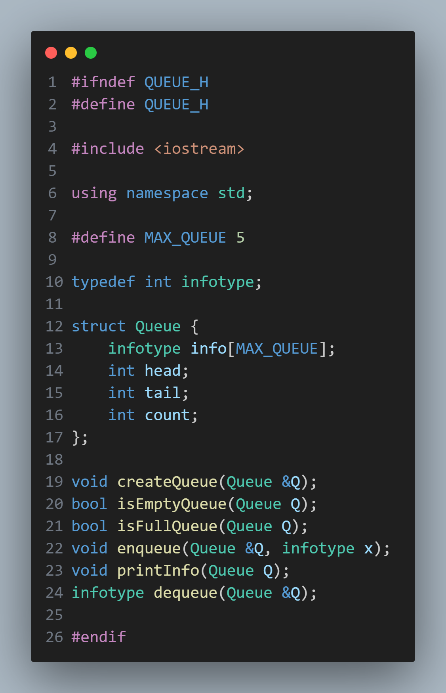
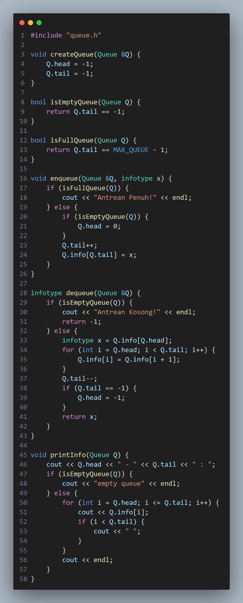
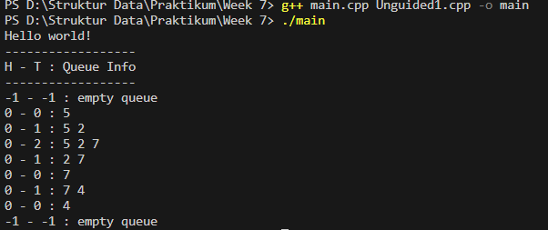
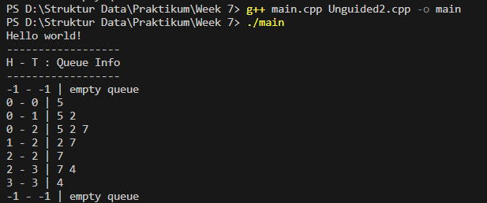
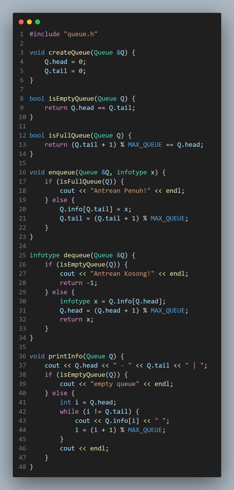
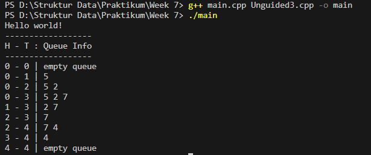

# Laporan Praktikum Struktur Data

## 1. Nama, NIM, Kelas
- **Nama**: Julian Saputra
- **NIM**: 103112400260
- **Kelas**: 12-IF-05

## 2. Motivasi Belajar Struktur Data
Saya sangat termotivasi memperlajari struktur data, kenapa saya belajat stuktur data karena saya sadar kalau struktur data itu pondasi yang sangat penting dalam pemrograman contohnya seperti kita akan membangun rumah yang membutuhkan pondasi. Lalu juga banyak aplikasi atau teknologi di dunia nyata contohnya kaya sistem pencarian, manajemen database, sampai ada juga kecerdasan buatan yang bekerja secara efisien dikarenakan menggunakan struktur data yang tepat dan baik. Jadi karena itu saya termotivasi belajar struktur data ini.

## 3. Dasar Teori
Struktur data merupakan cara menyimpan dan mengatur data agar dapat digunakan secara efisien oleh komputer. Salah satu struktur data yang penting dan sering digunakan adalah stack, karena memiliki prinsip penyimpanan data yang sederhana namun sangat berguna untuk berbagai kasus, seperti pembalikan urutan data, pengecekan ekspresi matematika, dan manajemen memori pada program.

### Berikut Dasar Teori nya :

1. Konsep Stack (Tumpukan):
Stack adalah struktur data yang menerapkan prinsip LIFO (Last In, First Out), artinya elemen terakhir yang dimasukkan ke dalam stack akan menjadi elemen pertama yang dikeluarkan. Operasi dasar pada stack meliputi:
a. push(): menambahkan elemen ke puncak stack.
b. pop(): menghapus elemen teratas dari stack.
c. isEmpty() dan isFull(): digunakan untuk memeriksa apakah stack kosong atau penuh.
Stack sering digunakan dalam pemrograman rekursif, sistem undo/redo, serta algoritma pembalikan data.

2. Konsep Fungsi push() dan pop():
Fungsi push() berfungsi menambahkan elemen ke dalam stack selama masih ada ruang kosong, sedangkan pop() digunakan untuk menghapus dan mengambil elemen teratas dari stack. Implementasi fungsi ini umumnya menggunakan array sebagai wadah penyimpanan dan variabel top sebagai penanda posisi elemen teratas. Jika top sudah mencapai batas maksimum, maka stack dianggap penuh (overflow), sedangkan jika top bernilai -1 maka stack kosong (underflow).

3. Konsep Fungsi pushAscending():
Fungsi ini merupakan variasi dari operasi push() yang menambahkan elemen baru ke dalam stack dengan menjaga urutan ascending (menaik) berdasarkan nilai elemen. Artinya, setiap kali elemen baru dimasukkan, posisinya akan diatur agar urutan dari bawah ke atas tetap dari kecil ke besar. Konsep ini sering digunakan untuk menjaga keterurutan data secara otomatis dalam tumpukan.

4. Konsep Fungsi getInputStream():
Fungsi ini digunakan untuk membaca input dari pengguna secara berurutan dan memasukkannya ke dalam stack. Input biasanya berupa karakter atau angka yang dibaca satu per satu menggunakan cin.get(). Proses ini berlanjut hingga pengguna menekan tombol Enter sebagai tanda akhir input. Dengan cara ini, data yang dimasukkan oleh pengguna langsung tersimpan dalam struktur stack dan dapat ditampilkan atau dibalik sesuai kebutuhan.

5. Konsep Fungsi balikStack():
Fungsi balikStack() digunakan untuk membalik urutan elemen dalam stack. Dengan menggunakan stack tambahan sementara, elemen dari stack asal dipindahkan satu per satu, sehingga urutannya terbalik. Konsep ini menunjukkan penerapan prinsip LIFO secara nyata — elemen terakhir yang dimasukkan menjadi yang pertama keluar, sehingga urutan data berubah total.

6. Konsep Traversal dan Modularisasi Program:
Traversal pada stack dilakukan dengan cara menelusuri isi stack dari elemen teratas hingga elemen terbawah. Dalam program, hal ini sering diimplementasikan melalui fungsi printInfo() untuk menampilkan isi stack. Setiap operasi (push, pop, balikStack, dan sebagainya) diletakkan dalam fungsi terpisah agar program lebih modular, mudah dipahami, serta mengikuti prinsip abstraksi dan reusabilitas kode.

## 4. Guided
### 4.1 Guided 1

Penjelasan : stack.h itu header file yang berisi rancangan struktur data stack (tumpukan) dengan prinsip LIFO (Last In, First Out). Di dalamnya terdapat deklarasi struktur Stack yang menyimpan data dalam array berukuran maksimal 20 elemen (MaxEl = 20) dan variabel top sebagai penanda posisi elemen teratas. Nilai top akan bernilai -1 (Nil) jika stack kosong. stack.h ini juga berisi deklarasi fungsi-fungsi penting seperti CreateStack untuk membuat stack kosong, isEmpty dan isFull untuk mengecek kondisi stack, push untuk menambah data, pop untuk mengambil data teratas, printInfo untuk menampilkan isi stack, serta balikStack untuk membalik urutan isi stack. Secara singkat, stack.h berfungsi sebagai rancangan dasar yang mendefinisikan bentuk dan operasi dasar pada stack, sedangkan implementasi logikanya biasanya ditulis di file lain, yaitu stack.cpp.

### 4.2 Guided 2

Penjelasan : stack.cpp ini berisi implementasi fungsi-fungsi yang sudah dideklarasikan di file stack.h. Fungsi CreateStack digunakan untuk membuat stack kosong dengan mengatur nilai top menjadi -1. Fungsi isEmpty dan isFull digunakan untuk memeriksa apakah stack kosong atau penuh. Fungsi push berfungsi menambahkan elemen baru ke bagian atas stack jika belum penuh, sedangkan pop digunakan untuk menghapus dan mengambil elemen teratas dari stack jika tidak kosong. Fungsi printInfo menampilkan isi stack dari elemen paling atas hingga paling bawah, dan akan menampilkan pesan jika stack kosong. Terakhir, fungsi balikStack digunakan untuk membalik urutan isi stack dengan cara memanfaatkan dua stack sementara. Secara keseluruhan, file ini berisi logika utama untuk mengoperasikan stack, mulai dari menambah, menghapus, menampilkan, hingga membalik data.

### 4.3 Guided 3

Penjelasan : Program ini fungsi main() yang digunakan untuk menguji operasi stack. Pertama, program membuat sebuah stack kosong dengan CreateStack(S). Kemudian beberapa operasi dilakukan: menambahkan elemen dengan push (3, 4, 8), menghapus elemen teratas dengan pop, lalu menambah elemen lagi (2, 3), menghapus lagi satu elemen, dan terakhir menambahkan angka 9. Setelah semua operasi selesai, program menampilkan isi stack menggunakan printInfo dengan judul "Stack Awal". Selanjutnya, fungsi balikStack dipanggil untuk membalik urutan isi stack, lalu hasilnya kembali ditampilkan dengan tulisan "Stack Setelah dibalik". Secara sederhana, program ini menunjukkan cara kerja dasar stack mulai dari penambahan, penghapusan, hingga pembalikan isi stack.

Output : 

## 5. Unguided
### 5.1 Unguided 1

Penjelasan : Program ini merupakan implementasi dasar dari operasi stack (tumpukan) dalam bahasa C++. Pertama, program menampilkan teks “Hello world!” lalu membuat sebuah stack kosong dengan memanggil fungsi CreateStack(S). Setelah itu, program melakukan beberapa operasi push untuk menambahkan elemen ke dalam stack, seperti angka 3, 4, dan 8. Kemudian dilakukan pop untuk menghapus elemen teratas, lalu ditambahkan lagi elemen 2, 3, dan 9 dengan kombinasi push dan pop sesuai urutan yang ada. Setelah semua operasi dilakukan, program menampilkan isi stack menggunakan fungsi printInfo(S). Selanjutnya, program menampilkan teks “balik stack” dan memanggil fungsi balikStack(S) untuk membalik urutan elemen dalam stack, kemudian menampilkan hasil akhirnya kembali. Program ini bertujuan untuk menunjukkan cara kerja operasi dasar pada struktur data stack, seperti push, pop, dan pembalikan urutan elemen.

Output : 

### 5.2 Unguided 2

Penjelasan : Program ini contoh penggunaan stack dengan fitur pushAscending, yaitu menambahkan elemen ke dalam stack secara berurutan dari nilai terkecil ke terbesar. Pertama, program menampilkan teks “Hello World!” lalu membuat stack kosong dengan CreateStack(S). Setelah itu, beberapa nilai seperti 3, 4, 8, 2, 3, dan 9 dimasukkan menggunakan pushAscending, sehingga elemen-elemen dalam stack otomatis tersusun naik berdasarkan nilainya. Fungsi printInfo(S) kemudian menampilkan isi stack. Selanjutnya, program menampilkan teks “balik stack” dan memanggil balikStack(S) untuk membalik urutan elemen di dalam stack, lalu hasil akhirnya kembali ditampilkan dengan printInfo(S). Program ini menunjukkan cara menambah elemen secara terurut naik serta membalik urutan stack dengan mudah.

Output : 

### 5.3 Unguided 3

Penjelasan : Program ini digunakan untuk membaca input dari pengguna dan menyimpannya ke dalam stack, lalu menampilkan isi stack sebelum dan sesudah dibalik. Pertama, program menampilkan teks “Hello world!” kemudian membuat stack kosong dengan CreateStack(S). Selanjutnya, fungsi getInputStream(S) digunakan untuk menerima input angka dari pengguna dan memasukkannya ke dalam stack satu per satu. Setelah semua data dimasukkan, fungsi printInfo(S) menampilkan isi stack dari atas ke bawah. Program lalu menampilkan pesan “balik stack”, memanggil fungsi balikStack(S) untuk membalik urutan elemen dalam stack, dan kembali menampilkan hasil akhirnya dengan printInfo(S). Program ini menunjukkan cara membaca input user ke dalam stack dan membalik urutannya.

Output : 

## 6. Kesimpulan
Jasi berdasarkan hasil pengerjaan program di atas, dapat saya simpulkan bahwa tujuan pembelajaran mengenai penerapan struktur data Stack (Tumpukan) telah berhasil dicapai. Melalui implementasi berbagai operasi seperti push, pop, pushAscending, getInputStream, printInfo, dan balikStack, saya memahami bagaimana data dapat disimpan dan dikelola menggunakan prinsip LIFO (Last In, First Out). Struktur data Stack memungkinkan pengelolaan data secara efisien, terutama dalam proses pembalikan urutan dan pengambilan elemen terakhir yang dimasukkan. Selain itu, penggunaan fungsi-fungsi terpisah menjadikan program lebih terstruktur, mudah dipahami, dan mendukung konsep modularisasi. Dengan demikian, praktikum ini memberikan pemahaman yang baik mengenai konsep dasar dan penerapan nyata dari struktur data Stack dalam bahasa C++.

## 7. Referensi
1. Programiz. “Stack Data Structure.” https://www.programiz.com/dsa/stack
2. GeeksforGeeks. “Stack Data Structure (Introduction and Implementation).” https://www.geeksforgeeks.org/stack-data-structure/
3. W3Schools. “C++ Functions.” https://www.w3schools.com/cpp/cpp_functions.asp